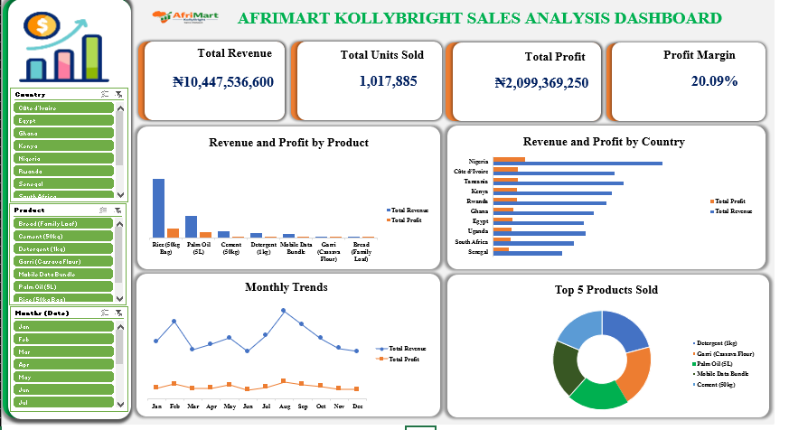

# AfriMart_KollyBright_Sales_Analysis

---
## Project Overview
This is a project carried out using pivot tables for analysis to track revenue and profit performance for AfriMart Kollybright using Microsoft Excel.

The AfriMart KollyBright Sales Analysis Dashboard is an interactive business Intelligence tool built to provide a consolidated view of sales performance across products, countries and time periods.
The dashboard is design for use for Sales Managers,Regional Managers and Executive leadership who need fast,reliable answers to performance questions without manually querying raw data.

---

## Business Questions
 -What is the total revenue?
 -What is the total Profit and profit Margin?
 -What is the total units sold?
 -Which country generated highest revenue and profit?
 -What product generated highest revenue and profit?

---

## Key KPIs
 -Total Revenue
 -Total units sold
 -Total Profit
 -Profit Margin

---
## Tools Used
 -Microsoft Excel
 -Pivot Tables
 -Excel Slicers
 -Pivot Charts
 -Excel Dashboard Techniques

---
## Dashboard Preview

---

## Key Insights
 -Nigeria generates the highest total revenue of any single country in the dataset
 -Rice(50kg) is the top-revenue generating product,followed by Palm oil(5L)
 -The overall profit margin sits at 20.09% indicating a stable but improvable margin profile.
 -Cement(50kg) shows the widest gap between revenue and profit suggesting higher cost of goods
 -Mobile data bundles carry a stronger margin relative to its revenue contribution.
 -Detergent(1kg) and Garri(Cassava flour) lead in units sold, driven by high purchase frequency.
 -Revenue peaks are visible mid-year and year end consistent with seansonal demand cycles
 -Profit tracks revenue closely with no significant margin deterioration during peak months.

---

## Files In this Repository
 -[Sales Dataset](Project on afrimart sales performance.xlsx)
 -[Dashboard Screenshot](AfriMart_KollyBright_Dashboard.png)
 -[Afrimart Logo](logo_afrimart-logo.png)
 -README.md

---

## Conclusion
The AfriMart KollyBright Sales Analysis Dashboard delivers a clear and reliable view of sales performance across AfriMart's African markets. With over ₦10.4 billion in total revenue, 1,017,885 units sold, and a 20.09% profit margin, the data reflects a business with strong market reach and consistent profitability across diverse product categories and geographies.

This dashboard is designed to reduce the time spent searching for answers and increase the time spent acting on them. Whether tracking a product's performance in a specific country, identifying seasonal revenue shifts, or evaluating margin health across the portfolio, every insight needed is available within a few filter selections.

As AfriMart continues to scale, this tool should be updated monthly with fresh data to remain a reliable foundation for decision-making at every level of the organisation

